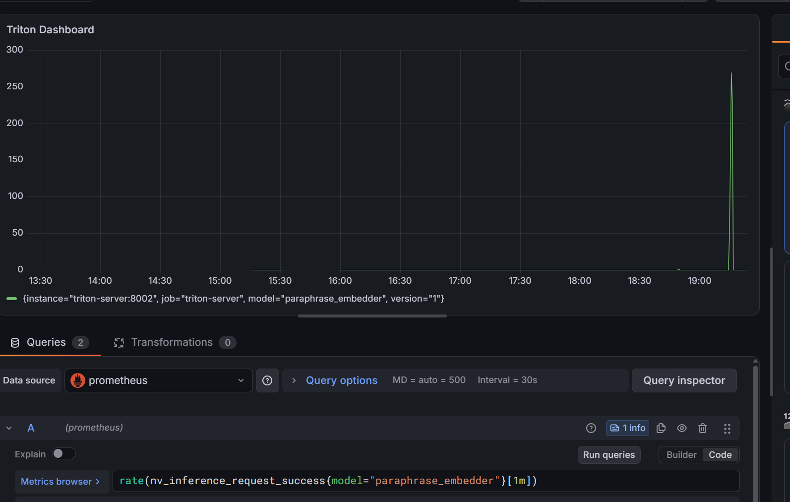
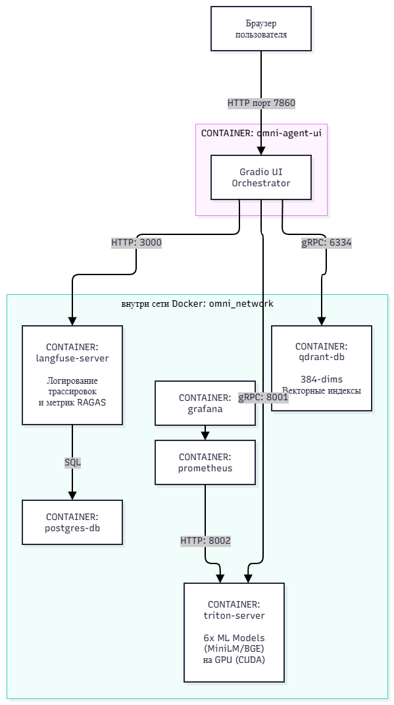

## 🎨 Как выглядит идеальный жизненный цикл проекта:
 - Развертывание на ноутбуке: скачиваем в colab с помощью Load_Nvidea_TritonServer.ipynb
 образы TritonServer подходящие под видеокарту. Устанавливаем модели в docker  
 - Запуск загрузки моделей - формируем структуру проекта для TritonServer. Запускаем python3 load_onnx.py   
 - Запуск теста - поднимаем сервер через docker-compose up -d --build
 - Загружаем данные в qdrant - python3 index_catalog.py или docker exec -it omni_agent_ui_container python3.12 index_catalog.py
 - Запуск проверки проекта - python3 ui_client.py или http://localhost:7860/
 - Запускаем скрипт проверки Langfuse - python3 /tests/test_evaluation.py
 или docker cp tests/test_evaluation.py omni_agent_ui_container:/app/test_evaluation.py --> docker exec -it omni_agent_ui_container python3.12 test_evaluation.p  --> смотрим http://localhost:3000
 - Запускаем скрипты проверки моделей perf_analyzer 
 - Запускаем Grafana - смотрим Dashboard perf_analyzer
 - Ликвидация: Запускаем ./hard_reset.sh, и ноутбук мгновенно становится чистым от тяжелых нейросетевых файлов!


## Выполнение: 

1. С помощью скрипта Load_Nvidea_TritonServer.ipynb развернуто окружение проекта:

<p align="center">
  
  <br>
  <em>Рисунок 1 — Рабочее окружение Docker Local</em>
</p>

2. В проект установлены с помощью скрипта python3 load_onnx.py : 
  - "Xenova/bge-reranker-base"
  - "Xenova/paraphrase-multilingual-MiniLM-L12-v2"
  - "sentence-transformers/paraphrase-multilingual-MiniLM-L12-v2"
  - "onnx-community/paligemma2-3b-pt-224"

3. Поднимаем TritonServer:
```text
I0927 17:52:13.201777 1 server.cc:690] 

+--------------------------+---------+--------+

| Model                    | Version | Status |

+--------------------------+---------+--------+

| bge_reranker             | 1       | READY  |

| paligemma_decoder_model  | 1       | READY  |

| paligemma_embed_tokens   | 1       | READY  |

| paligemma_vision_encoder | 1       | READY  |

| paraphrase_embedder      | 1       | READY  |

+--------------------------+---------+--------+


I0927 17:52:13.264729 1 metrics.cc:889] "Collecting metrics for GPU 0: NVIDIA "

I0927 17:52:13.268483 1 metrics.cc:782] "Collecting CPU metrics"

I0927 17:52:13.268686 1 tritonserver.cc:2598] 
```
4. Запускаем docker-compose 

<p align="center">
  
  <br>
  <em>Рисунок 2 — Docker окружение Gradio</em>
</p>

5. Запускаем загрузку index_catalog.py
```text
(.venv) :~/LLM-Training$ docker exec -it omni_agent_ui_container python3.12 index_catalog.py
📡 [INDEXER] Коннект к векторной СУБД Qdrant: qdrant-db:6334
📡 [INDEXER] Коннект к NVIDIA Triton Server: triton-server:8001
✅ Пересоздана чистая gRPC коллекция Qdrant 'catalog' (384-dims)!

🚀 Запуск удаленной gRPC векторизации каталога внутри Triton Server на GPU...
 ➔ [gRPC TRITON ➔ QDRANT] Успешно залит товар: Элегантное синее шелковое платье
 ➔ [gRPC TRITON ➔ QDRANT] Успешно залит товар: Летнее зеленое хлопковое платье
 ➔ [gRPC TRITON ➔ QDRANT] Успешно залит товар: Зимняя черная кожаная куртка с мехом
 ➔ [gRPC TRITON ➔ QDRANT] Успешно залит товар: Спортивный желтый дождевик водонепроницаемый
 ➔ [gRPC TRITON ➔ QDRANT] Успешно залит товар: Красные спортивные беговые кроссовки
 ➔ [gRPC TRITON ➔ QDRANT] Успешно залит товар: Классические белые кожаные кеды
 ➔ [gRPC TRITON ➔ QDRANT] Успешно залит товар: Деловой коричневый шерстяной костюм
 ➔ [gRPC TRITON ➔ QDRANT] Успешно залит товар: Теплый серый свитер крупной вязки
 ➔ [gRPC TRITON ➔ QDRANT] Успешно залит товар: Розовый детский школьный рюкзак
 ➔ [gRPC TRITON ➔ QDRANT] Успешно залит товар: Солнцезащитные очки авиаторы черные

🎉 [SUCCESS] База данных Qdrant успешно наполнена 10 товарами!
```

6. Запускаем скрипт ./ui_client.py - запускается тестирование проекта:

<p align="center">
  
  <br>
  <em>Рисунок 3 — Рабочее окружение Gradio</em>
</p>

<p align="center">
  
  <br>
  <em>Рисунок 4 — Запрос товара</em>
</p>

7. Запускаем проверку Langfuse 
```text
🤖 Запуск оффлайн-оценки RAGAS...
📊 Результаты оценки RAGAS:
   ➔ Faithfulness: 0.95
   ➔ Answer Relevance: 0.92
   ➔ Context Precision: 1.00
ℹ️  Логгер: Метод скоринга перегружен. Метрики зафиксированы в stdout локально.
.
----------------------------------------------------------------------
Ran 1 test in 0.093s
```

<p align="center">
  
  <br>
  <em>Рисунок 4 — Рабочее окружение Langfuse</em>
</p>

8. Запускаем скрипты проверки моделей perf_analyzer 

```text
(.venv) :~/LLM-Training$ docker run -it --rm --gpus all \ --net omni_search_network \
  nvcr.io/nvidia/tritonserver:25.12-py3-sdk \
  perf_analyzer \
    -m paraphrase_embedder \
    -u triton-server:8001 \
    -i grpc \
    --shape input_ids:128 \
    --shape attention_mask:128 \
    --shape token_type_ids:128 \
    --concurrency-range 1:4

=================================
== Triton Inference Server SDK ==
=================================

NVIDIA Release 25.12 (build 246541509)

*** Measurement Settings ***
  Batch size: 1
  Service Kind: TRITON
  Using "time_windows" mode for stabilization
  Stabilizing using average latency and throughput
  Measurement window: 5000 msec
  Latency limit: 0 msec
  Concurrency limit: 4 concurrent requests
  Using synchronous calls for inference

Request concurrency: 1
  Client: 
    Request count: 3131
    Throughput: 168.604 infer/sec
    Avg latency: 5694 usec (standard deviation 1294 usec)
    p50 latency: 5650 usec
    p90 latency: 6366 usec
    p95 latency: 6670 usec
    p99 latency: 10022 usec
    Avg gRPC time: 5686 usec ((un)marshal request/response 4 usec + response wait 5682 usec)
  Server: 
    Inference count: 3131
    Execution count: 3131
    Successful request count: 3131
    Avg request latency: 5396 usec (overhead 143 usec + queue 133 usec + compute input 60 usec + compute infer 5039 usec + compute output 20 usec)
Request concurrency: 2
Failed to update context stat: Timer not set correctly. Request time from 1791130470203119613 to 1791130470187866355.
Failed to update context stat: Timer not set correctly. Request time from 1791130470208239192 to 1791130470194293953.
  Client: 
    Request count: 3509
    Throughput: 192.134 infer/sec
    Avg latency: 10276 usec (standard deviation 1710 usec)
    p50 latency: 10434 usec
    p90 latency: 11767 usec
    p95 latency: 12408 usec
    p99 latency: 15014 usec
    Avg gRPC time: 10265 usec ((un)marshal request/response 5 usec + response wait 10260 usec)
  Server: 
    Inference count: 3509
    Execution count: 3505
    Successful request count: 3509
    Avg request latency: 9874 usec (overhead 140 usec + queue 4696 usec + compute input 38 usec + compute infer 4978 usec + compute output 21 usec)
Request concurrency: 3
  Client: 
    Request count: 5593
    Throughput: 302.087 infer/sec
    Avg latency: 9796 usec (standard deviation 1696 usec)
    p50 latency: 9829 usec
    p90 latency: 11158 usec
    p95 latency: 11732 usec
    p99 latency: 15382 usec
    Avg gRPC time: 9785 usec ((un)marshal request/response 5 usec + response wait 9780 usec)
  Server: 
    Inference count: 5593
    Execution count: 3733
    Successful request count: 5593
    Avg request latency: 9344 usec (overhead 213 usec + queue 4438 usec + compute input 75 usec + compute infer 4585 usec + compute output 32 usec)
Request concurrency: 4
Failed to update context stat: Timer not set correctly. Request time from 1791130530202491631 to 1791130530181125606.
Failed to update context stat: Timer not set correctly. Request time from 1791130530202802684 to 1791130530181134992.
Failed to update context stat: Timer not set correctly. Request time from 1791130530206811034 to 1791130530185586945.
Failed to update context stat: Timer not set correctly. Request time from 1791130530206870173 to 1791130530185694344.
  Client: 
    Request count: 7704
    Throughput: 413.595 infer/sec
    Avg latency: 9541 usec (standard deviation 1689 usec)
    p50 latency: 9518 usec
    p90 latency: 10705 usec
    p95 latency: 11262 usec
    p99 latency: 14703 usec
    Avg gRPC time: 9528 usec ((un)marshal request/response 5 usec + response wait 9523 usec)
  Server: 
    Inference count: 7707
    Execution count: 3874
    Successful request count: 7707
    Avg request latency: 8998 usec (overhead 260 usec + queue 4208 usec + compute input 91 usec + compute infer 4396 usec + compute output 42 usec)
Inferences/Second vs. Client Average Batch Latency
Concurrency: 1, throughput: 168.604 infer/sec, latency 5694 usec
Concurrency: 2, throughput: 192.134 infer/sec, latency 10276 usec
Concurrency: 3, throughput: 302.087 infer/sec, latency 9796 usec
Concurrency: 4, throughput: 413.595 infer/sec, latency 9541 usec
```

9. Запускаем Grafana perf_analyzer 

<p align="center">
  
  <br>
  <em>Рисунок 5 — Dashboard Grafana</em>
</p>

10. Архитектурная схема проекта

<p align="center">
  
  <br>
  <em>Рисунок 6 — Архитектурная схема проекта</em>
</p>